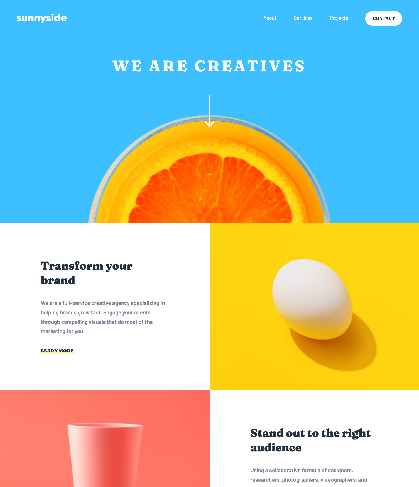

# Frontend Mentor - Sunnyside agency landing page solution

This is a solution to the [Sunnyside agency landing page challenge on Frontend Mentor](https://www.frontendmentor.io/challenges/sunnyside-agency-landing-page-7yVs3B6ef). Frontend Mentor challenges help you improve your coding skills by building realistic projects.

## Table of contents

- [Overview](#overview)
  - [The challenge](#the-challenge)
  - [Screenshot](#screenshot)
  - [Links](#links)
- [My process](#my-process)
  - [Built with](#built-with)
  - [What I learned](#what-i-learned)
  - [Continued development](#continued-development)
  - [Useful resources](#useful-resources)
- [Author](#author)
- [Acknowledgments](#acknowledgments)

## Overview

### The challenge

Users should be able to:

- View the optimal layout for the site depending on their device's screen size
- See hover states for all interactive elements on the page

### Screenshot




### Links

- Solution URL: [https://github.com/allyson-s-code/Sunnyside-Landing_Page](https://github.com/allyson-s-code/Sunnyside-Landing_Page)
- Live Site URL: [https://allyson-s-code.github.io/Sunnyside-Landing_Page/](https://allyson-s-code.github.io/Sunnyside-Landing_Page/)

## My process

### Built with

- Semantic HTML5 markup
- CSS custom properties
- Flexbox
- Mobile-first workflow
- JavaScript

### What I learned

I learned a lot of css tricks with this project. I learned more about pseudo classes and elements, creating a shaped dropdown, and got more practice with hover states.

I used a little JavaScript for the menu drop down and was able to add an extra function to detect a click outside of the dropdown menu to close (in addition to the toggle of the hamburger menu button). When my second event listener was not working someone suggested I add `e.stopPropagation()` to my toggle button event handler and that did the trick.

I continue to learn about making html accessible with aria labels and `aria-expanded` in the case of the hamburger menu.

Hamburger Menu Button:

```html
<button
  aria-label="menu"
  aria-expanded="false"
  aria-controls="#nav"
  class="toggle-menu"
>
  <svg
    width="24"
    height="18"
    xmlns="http://www.w3.org/2000/svg"
    alt="hamburger menu icon"
    class="hamburger-menu"
    aria-hidden="true"
    focusable="false"
  >
    <path
      d="M24 16v2H0v-2h24zm0-8v2H0V8h24zm0-8v2H0V0h24z"
      fill="#FFF"
      fill-rule="evenodd"
    />
  </svg>
</button>
```

For offset underline hover state:

```css
a.learn-more.stand-out::after {
  content: "";
  position: absolute;
  top: 55%;
  left: -5px;
  right: -5px;
  height: 10px;
  border-radius: 10px;
  background-color: hsl(7, 99%, 70%, 0.3);
  z-index: -1;
}

a.learn-more.stand-out:hover::after {
  background-color: hsl(7, 99%, 70%);
  transition: 0.5s;
}
```

### Continued development

I'll be working on JavaScript some more for sure. I definitely feel that getting the html more accesible and organizing and making my CSS more efficient will continue to be a top priority.

### Useful resources

- [mdn web docs- CSS- ::before](https://developer.mozilla.org/en-US/docs/Web/CSS/::before) -
- [freeCodeCamp A simplified expanation of event propagation](https://www.freecodecamp.org/news/a-simplified-explanation-of-event-propagation-in-javascript-f9de7961a06e/)

## Author

- Website - [Allyson Smith](https://allyson-s-code.github.io/Web-Dev-Portfolio/)

- Frontend Mentor - [@allyson-s-code](https://www.frontendmentor.io/profile/allyson-s-code)

## Acknowledgments

Thanks to Amon and Grace on Frontend Mentor Slack for helping with my accessibility and with the event propagation tip!
